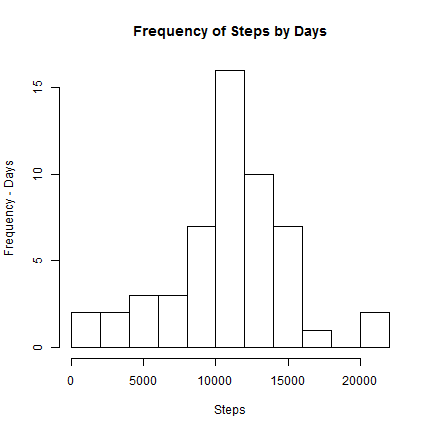

## Loading and preprocessing the data

```r
setwd("C:/Users/Keno/Desktop/R/Reprod_1")
act <- read.csv("activity.csv", stringsAsFactors = FALSE)

# Convert dates to Date format
act$date <- as.Date(act$date)
```

## What is mean total number of steps taken per day?
1. Make a histogram of the total number of steps taken each day


```r
dailysteps <- aggregate(steps ~ date, data = act, FUN="sum")
hist(dailysteps$steps, 
     breaks = 10, 
     ylab = "Frequency - Days",
     xlab = "Steps", 
     main = "Frequency of Steps by Days")
```

 

2. Calculate and report the mean and median total number of steps taken per day


```r
mean(dailysteps$steps)
```

```
## [1] 10766.19
```

```r
median(dailysteps$steps)
```

```
## [1] 10765
```
## What is the average daily activity pattern?
1. Make a time series plot (i.e. type = "l") of the 5-minute interval (x-axis) and the average number of steps taken, averaged across all days (y-axis)
2. Which 5-minute interval, on average across all the days in the dataset, contains the maximum number of steps?


```r
# Aggregate by average of steps/interval
intsteps <- aggregate(steps ~ interval, data = act, FUN = "mean")
# Interval in minutes
intsteps$intmin <- seq(0, (nrow(intsteps) - 1) * 5, by = 5)

# Plot Line Graph of Steps by Minute intervals
plot(intsteps$intmin, intsteps$steps, 
     type = "l",
     ylab = "Steps",
     xlab = "Minutes of Day",
     main = "Average Steps in Each 5min Interval")

# Line through maximum steps
abline(v = intsteps[grep(max(intsteps$steps), intsteps$steps),3],
       col = "red",
       lwd = "2")

# Print interval and number of steps onto graph
text(600, 150, 
     adj = 0, 
     paste("Max Steps =", 
           round(max(intsteps$steps), 1),
           "\n Interval =", 
           intsteps[grep(max(intsteps$steps), intsteps$steps),3]))
```

 


## Imputing missing values
1. Calculate and report the total number of missing values in the dataset (i.e. the total number of rows with NAs)

```r
sum(is.na(act$steps))
```

```
## [1] 2304
```

2. Devise a strategy for filling in all of the missing values in the dataset. The strategy does not need to be sophisticated. For example, you could use the mean/median for that day, or the mean for that 5-minute interval, etc.
3. Create a new dataset that is equal to the original dataset but with the missing data filled in.


```r
# Clones old dataset into new one
act2 <- act

# Finds row index of all NA's
# Replaces all NA's with average steps per interval (intsteps dataframe) calculated earlier

for (i in which(sapply(act$steps, is.na))) {
    act2[i, "steps"] <- intsteps[intsteps$interval == act2[i, "interval"], "steps"]
    }

# Any NA's in new dataset?
sum(is.na(act2$steps))
```

```
## [1] 0
```


4. Make a histogram of the total number of steps taken each day and Calculate and report the mean and median total number of steps taken per day. Do these values differ from the estimates from the first part of the assignment? What is the impact of imputing missing data on the estimates of the total daily number of steps?

```r
# Re-aggregating for new dataset
dailysteps2 <- aggregate(steps ~ date, data = act2, FUN="sum")
intsteps2 <- aggregate(steps ~ interval, data = act2, FUN = "mean")
intsteps2$intmin <- seq(0, (nrow(intsteps2) - 1) * 5, by = 5)

#Plotting with both new (Without NA's, Red) & old (With Na's, Green) dataset
hist(dailysteps$steps, 
     breaks = 10, ylim = c(0,25),
     ylab = "Frequency - Days", xlab = "Steps", 
     main = "Frequency of Steps by Days",
     col = "green", angle = 135, density = 10)

hist(dailysteps2$steps, 
     breaks = 10, 
     col = "red", angle = 45, density = 10, add = TRUE)

legend("topleft", border = NULL, density = 20,
       c("With NA's", "Without NA's"), 
       fill = c("green", "red"), bty = "n", cex = 1.5)
```

 

```r
# Presenting data of mean & median from both tables
data.frame(With_NAs = c(mean(dailysteps$steps), median(dailysteps$steps)), 
           Without_NAs = c(mean(dailysteps2$steps), median(dailysteps2$steps)), 
           row.names = c("Mean", "Median"))
```

```
##        With_NAs Without_NAs
## Mean   10766.19    10766.19
## Median 10765.00    10766.19
```

## Are there differences in activity patterns between weekdays and weekends?
1. Create a new factor variable in the dataset with two levels - "weekday" and "weekend" indicating whether a given date is a weekday or weekend day.

```r
# Add column of day based on day using weekdays()
# Replace Mon > Fri with Weekday, Sat/Sun to Weekend
act$day <- weekdays(act$date)
act[act$day %in% c("Monday", "Tuesday", "Wednesday", "Thursday", "Friday"), "day"] <- "Weekday"
act[act$day %in% c("Saturday", "Sunday"), "day"] <- "Weekend"
act$day <- factor(act$day, levels = c("Weekday", "Weekend"))

str(act)
```

```
## 'data.frame':	17568 obs. of  4 variables:
##  $ steps   : int  NA NA NA NA NA NA NA NA NA NA ...
##  $ date    : Date, format: "2012-10-01" "2012-10-01" ...
##  $ interval: int  0 5 10 15 20 25 30 35 40 45 ...
##  $ day     : Factor w/ 2 levels "Weekday","Weekend": 1 1 1 1 1 1 1 1 1 1 ...
```


2. Make a panel plot containing a time series plot (i.e. type = "l") of the 5-minute interval (x-axis) and the average number of steps taken, averaged across all weekday days or weekend days (y-axis). See the README file in the GitHub repository to see an example of what this plot should look like using simulated data.


```r
# Aggregate mean of steps by weekday/weekend, then convert interval to absolute minutes
aggDS <- aggregate(steps ~ interval + day, data = act, FUN = "mean")
aggDS$interval <- (trunc(aggDS$interval / 100) * 60) + (aggDS$interval/100 - trunc(aggDS$interval/100)) *100

require(ggplot2)
qplot(interval, steps, data=aggDS, geom="line", col=day) + 
    facet_wrap( ~day, nrow=2) + 
    labs(title="Average Steps per 5 min Interval", x="Intervals (5 Minutes)", y="Steps")
```

 
